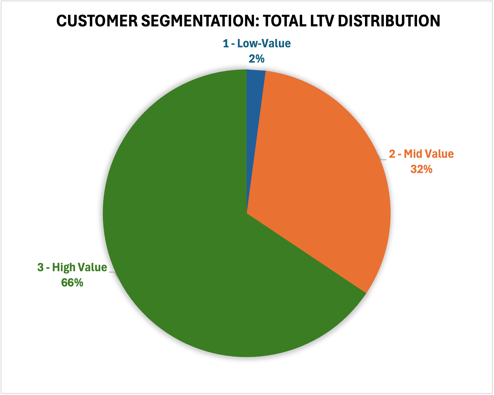
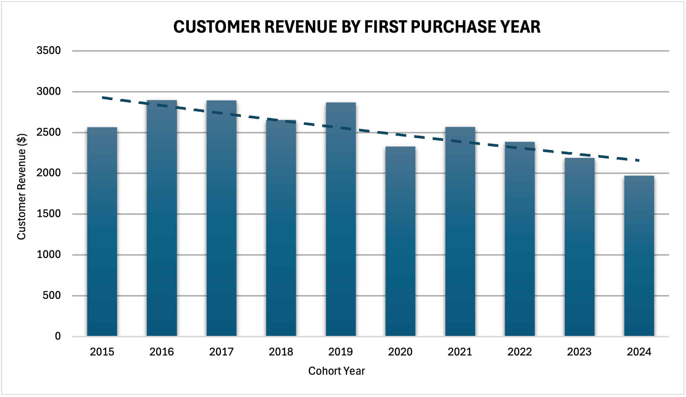
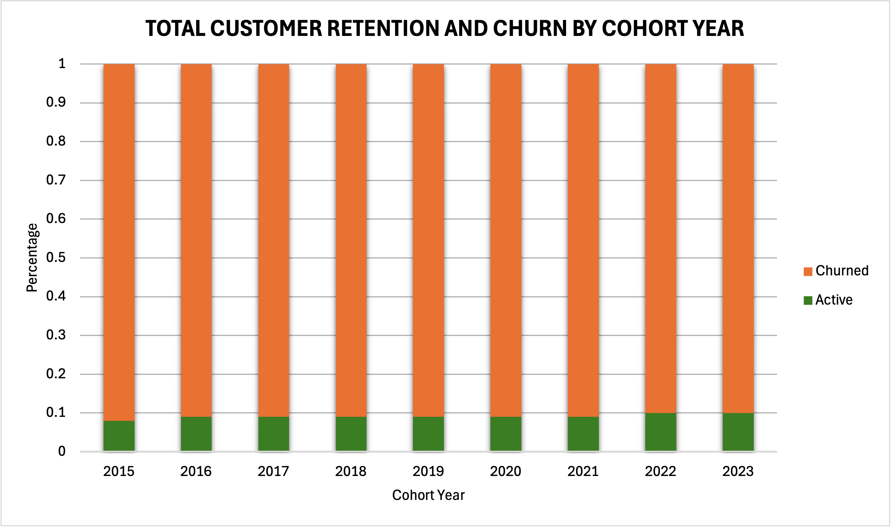

# Intermediate SQL - Sales Analysis

## Overview
This project is based on a tutorial from Luke Barousse, titled SQL for Data Analytics – Intermediate Course + Project ([link](https://youtu.be/QKIGsShyEsQ?si=qH8l4tPs93qXxf9Y)), which I followed to learn the workflow for analysing customer behaviour and retention using SQL. I then built on the tutorial by creating visualisations in Excel using the query outputs. 

The project explores customer behaviour, retention, and lifetime value for an e‑commerce company to improve customer retention and maximise revenue.

### Tools 
- **Database:** PostgreSQL
- **Analysis Tools:** DBeaver, pgAdmin
- **Visualisation:** Excel (charts created from exported query results)

## Business Questions

 1. **Customer Segmentation:** Who are the most valuable customers?
 2. **Cohort Analysis:** How do different customer groups generate revenue?
 3. **Customer Retention:** Which customers haven't purchased recently?

## Clean Data
Query: [0_create_view.sql](0_create_view.sql)

- Aggregated sales and customer data into revenue metrics
- Calculated first purchase dates for cohort analysis
- Created view combining transactions and customer details

## Analysis

### 1. Customer Segementation Analysis

- Categorised customers based on total lifetime value (LTV)
- Assigned customers to High, Mid, and Low-value segments
- Calculated total revenue

Query: [1_customer_segmentation.sql](1_customer_segmentation.sql)

**Visualisation:**

**Key Findings:**

- High-value segment (25% of customers) drives 66% of revenue.
- Mid-value segment (50% of customers) generates 32% of revenue.
- Low-value segment only drives 2% of revenue.

**Business Recommendations**

- High-Value (66% revenue): Offer premium membership program to 12,372 VIP customers, as losing one customer significantly impacts revenue.
- Mid-Value: Created upgrade paths through personalised promotions.
- Low-Value: Design re-engagement campaigns and price-sensitive promotions to increase purchase frequency.

### 2. Cohort Analysis 

- Tracked revenue and customer count per cohorts
- Cohorts were groups by year of first purchase
- Analysed customer retention at a cohort level

Query: [2_cohort_analysis.sql](/2_cohort_analysis.sql)

**Visualisation:**
 
Customer Revenue by Cohort (Adjusted for time in market) - First Purchase Date

**Key Findings:**

- Revenue per customer is decreasing over time.
- 2022-2024 cohorts are consistently perorming worse than earlier cohorts.

**Business Recommendations**
- Value extracted from customers is decreasing over time, so recent cohorts should be targeted with personalised offers to prevent churn.
- Introduce loyalty programs or subscriptions to ensure consistent spending.
- With both lowering LTV and decreasing customer acquisition, the company is facing a potential revenue decline. Strategies from high-spending cohorts (2016-2018) should be investigated and applied to recent cohorts.

### 3. Customer Retention

- Identified customers at risk of churning
- Analysed last purchase patterns
- Calculated customer-specific metrics

Query: [3_retention_analysis.sql](/3_retention_analysis.sql)

**Visualisation:**

**Key Findings:**
 
 - Cohort churn stabilises at ~90% after 2-3 years, indicating a predicatable long-term retention pattern.
 - Retention rates are consistently low (8-10%) across all cohorts, suggesting retention issues are systemic rather than specific to certain years.
 - Newer cohorts (2022-2023) show similar churn trajectories, suggesting that future cohorts will follow the same pattern if there are no efforts to intervene.

 **Business Recommendations**

 - Strengthen early engagement strategies to target the first 1-2 years with onboarding incentives, loyalty rewards, and personalised offers to improve long-term retention.
 - Re-engaged high-value churned customers by focusing on targeted win-back campaigns rather than broad retention efforts, as reactivating valuable users may yield higher ROI.

